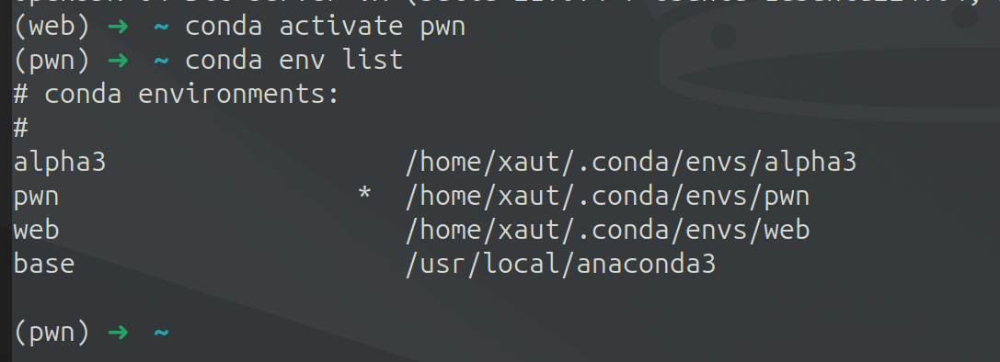
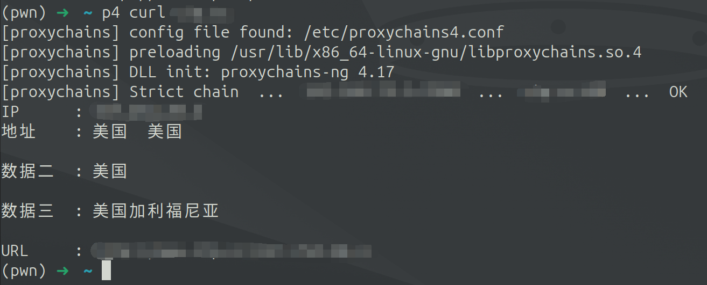
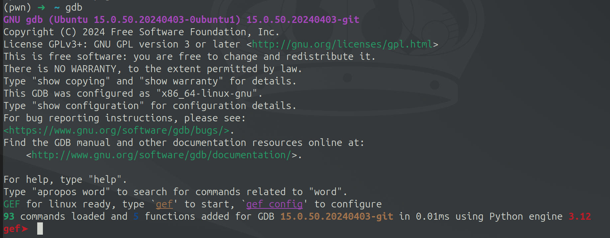
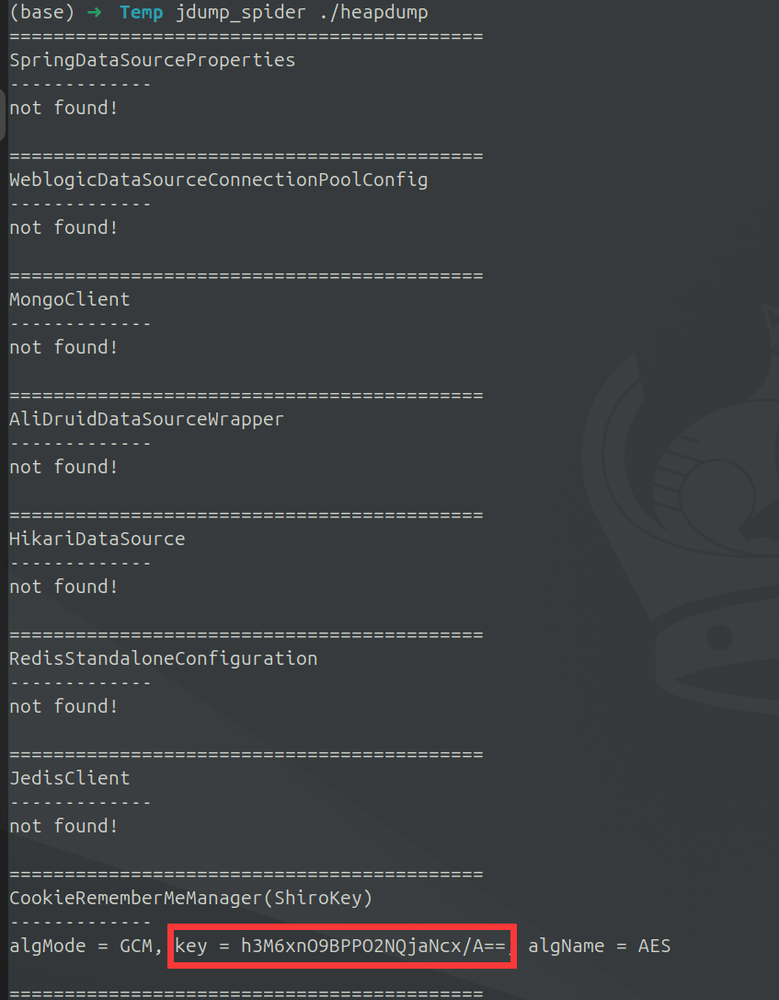

## 快速安装

文件中分别有`Ubuntu24.04_ovf.zip`和`Ubuntu24.04.zip`文件，可以选择`任意一个`下载

`Ubuntu24.04_ovf.zip`文件解压后需要通过VMWare导入`ovf`文件即可。`Ubuntu24.04.zip`文件则解压通过VMware打开`vmx`文件即可。

其中`iso`文件夹中的`iso`文件，是`Ubuntu24.04`的系统镜像文件。

**详细虚拟机教程可以自行查找学习。**


`Github`开源地址：

```
https://github.com/c0mentropy/CTF_Ubuntu24.04.git
```


下载链接：

```
通过百度网盘分享的文件：Ubuntu24.04_CTF
链接：https://pan.baidu.com/s/1OVxcDnNX6VmzNlku7m_tFQ?pwd=XAUT 
提取码：XAUT 
--来自百度网盘超级会员V3的分享
```


## 环境说明

这是一个基于`Ubuntu24.04`搭建的基础CTF环境，内置了`web`和`pwn`部分常用的工具，和LINUX基础工具等。**其中绝大部分工具都加载进了环境变量里，对新手使用非常友好。**

默认用户密码：

```
username: xaut
password: xaut
```

默认root密码：

```
username: root
password: XAUTCTF@
```

用户名密码大家可以自行修改。


**`特别说明：截止到我打包环境，我只想到了这些常用工具，后续有其他工具会再同步更新，或者大家也可以自行下载。而且为了避免环境太乱，所以只是大概测试了环境功能，如果有任何bug可以联系我，或自行修改。`**


### 基础环境

`openssh-server` `gedit` `docker` `java8` `java11` `java17` `java21` `anaconda3` `proxychains4`


java有常用的四个版本，可以切换需要的版本，也在bash里新增了对应四个版本的命令


`codna`的python环境常用的有两个为`pwn`和`web`，其他环境为对应工具的**单独**环境，无需加载使用

```bash
codna activate web
codna activate pwn
```




`proxychains4`的配置文件在`/etc/proxychains4.conf`，可以直接使用`p4`接一个命令来走代理

```bash
p4 curl www.google.com
```




### PWN环境

`gcc` `g++` `gdb` `pwndbg` `pwndgdb` `gef` `seccomp_tools` `one_gadget` `ROPgagdet` `ropper` `glibc-all-in-one` `patchelf` `pwnScript` `pwncli`

`pwntools`


其中`pwndbg`和`gef`是**同一个功能**插件，如果需要切换，则需要修改`~/.gdbinit`文件里的注释即可。


`pwndbg`:


`gef`:




其他的就不一一展示了，使用如下：


### WEB环境

`fscan` `nmap` `sqlmap` `msfconsole` `jDumpSpider`


具体使用如下：

`fscan`:


`nmap`:


`sqlmap`:


`msfconsole`:


`jDumpSpider`:




### MISC环境

`basecrack`


## 写在最后

我想说的是，在我第一次接触CTF的时候，配环境真的是很烦很痛苦的一个环节。以至于我差点放弃。所以我有了打包一个基础的LINUX环境，让各位可以先跳过这个环节，之后再一点一点慢慢学习。加油各位，希望可以在CTF这条路上陪大家走得更久！

对了，如果有**PWN方向**疑问可以和我一起讨论学习！！


作者：ckyan

日期：2024.08.02 

