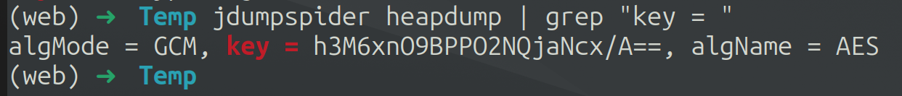
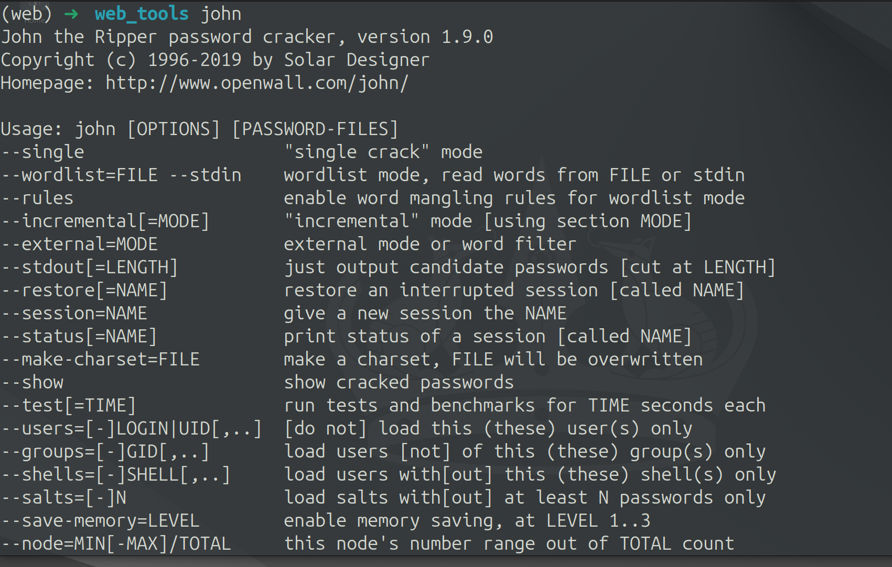
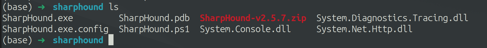
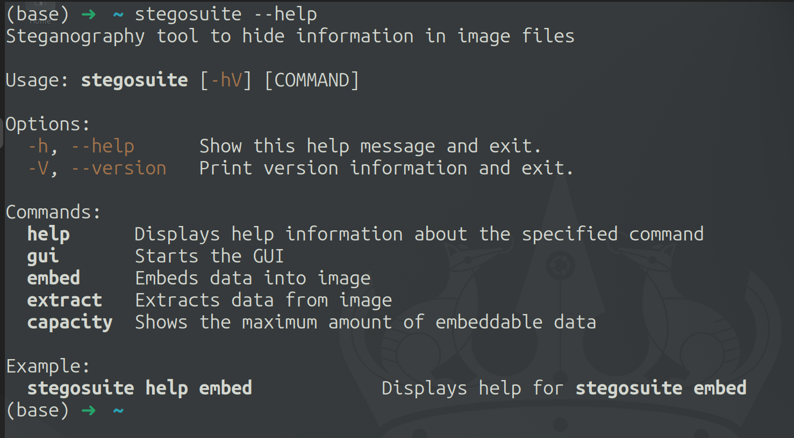
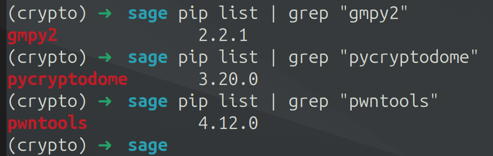

## 快速安装

`2024.08.02`文件夹中为`最初`分享的一个Ubuntu24.04环境，只有部分常用工具。

`2024.08.10`文件夹中为`最新`分享的一个Ubuntu24.04环境，包含大部分渗透工具和其他方向常用工具。


- 对应文件夹中分别有`Ubuntu24.04_ovf.zip`和`Ubuntu24.04.zip`文件，可以选择`任意一个`下载

- `Ubuntu24.04_ovf.zip`文件解压后需要通过VMWare导入`ovf`

- `f`文件即可。`Ubuntu24.04.zip`文件则解压通过VMware打开`vmx`文件即可。

- 其中`iso`文件夹中的`iso`文件，是`Ubuntu24.04`的系统镜像文件。
- **详细虚拟机教程可以自行查找学习。**

**由于最新上传的版本磁盘较大，下载可能会比较慢，所以可以对照着`工具列表速览`自行安装对应工具。后续大概率不会再打包整个环境（因为从导出到压缩再上传也很费时间），只会同步更新工具列表和下载方式，供大家学习。**

> **！！！！注意！！！！：下载好虚拟机请自行修改CPU核心数和内存等，根据自己电脑配置修改为建议大小即可。如遇到黑屏无法进入系统，可以关闭显示器设置里的加速3D图形！**


`Github`开源地址：

```
https://github.com/c0mentropy/CTF_Ubuntu24.04
```

<u>觉得不错还希望动动小手点一个star，这对我来说真的非常重要╰(✿´⌣`✿)╯♡ 感谢！</u>

下载链接：

```
通过百度网盘分享的文件：Ubuntu24.04_CTF
链接：https://pan.baidu.com/s/1OVxcDnNX6VmzNlku7m_tFQ?pwd=XAUT 
提取码：XAUT 
```


## 环境说明

这是一个基于`Ubuntu24.04`搭建的基础CTF环境，内置了`web`和`pwn`等其他方向的部分常用工具，和LINUX基础工具等。**其中绝大部分工具都加载进了环境变量里，对新手使用非常友好。**

默认用户密码：

```
username: xaut
password: xaut
```

默认root密码：

```
username: root
password: XAUTCTF@
```

用户名密码大家可以自行修改。

> **特别说明**：截止到我打包环境，我只想到了这些常用工具，后续有其他工具会再同步更新，或者大家也可以自行下载。而且为了避免环境太乱，所以只是大概测试了环境功能，如果有任何bug可以联系我，或自行修改！


### 工具列表速览

基础环境：

`openssh-server` `gedit` `docker` `gcc` `g++` `java8` `java11` `java17` `java21` `anaconda3` `golang` `rust` `proxychains4` `vscode` `tmux` `p7zip-full` `mingw-w64`

PWN环境：

`gdb` `pwndbg` `pwngdb` `gef` `seccomp_tools` `one_gadget` `ROPgagdet` `ropper` `glibc-all-in-one` `patchelf` `pwnScript` `pwncli` `pwntools` `alpha3` `binwalk`

WEB环境：

`fscan` `nmap` `sqlmap` `msfconsole` `jDumpSpider` `fenjing` `impacket` `dirsearch` `john` `gobuster` `wfuzz` `faketime` `BloodHound` `searchsploit` `evil-winrm` `rogue_mysql_server` `ysoserial-all.jar` `kerbrute` `frp` `EarthWorm` `burpsuite` `AntSword` `reverseshell` `pwncat` `hashcat` `swaks` `smbclient` `PowerSploit` `CrackMapExec`

MISC环境：

`basecrack` `CyberChef` `wireshark` `stegosuite` `zsteg`

CRYPTO环境：

`gmpy2` `pycryptodome` `pwntools` `sage` 


### 基础环境

`openssh-server` `gedit` `docker` `gcc` `g++` `java8` `java11` `java17` `java21` `anaconda3` `golang` `rust` `proxychains4` `vscode` `tmux` 等


特殊说明：我在系统中加入了`kali`的源，方便使用apt下载一些kali上的工具


#### `java`:

java有常用的四个版本，可以切换需要的版本，也在bash里新增了对应四个版本的命令


#### `conda`:

`codna`的python环境常用的有三个，分别为`pwn`、`web`和`crypto`，其他环境为对应工具的**单独**环境，无需加载使用

```bash
codna activate web
codna activate pwn
codna activate crypto
```


#### `proxychains4`:

`proxychains4`的配置文件在`/etc/proxychains4.conf`，可以直接使用`p4`接一个命令来走代理

```bash
p4 curl www.google.com
```


#### `language`:

`gcc` & `g++` & `golang` & `rust`:


#### `vscode`:


#### `tmux`:


#### `mingw-w64`:


### PWN环境

`gdb` `pwndbg` `pwngdb` `gef` `seccomp_tools` `one_gadget` `ROPgagdet` `ropper` `glibc-all-in-one` `patchelf` `pwnScript` `pwncli` `pwntools` `alpha3` `binwalk` 等


#### `conda activate pwn`:

大部分工具均为python开发，所以使用`pwn`工具时建议进入`pwn`的python环境

```bash
conda activate pwn
```


#### `gdb`：

其中`pwndbg`和`gef`是**同一个功能**插件，如果需要切换，则需要修改`~/.gdbinit`文件里的注释即可。


##### `pwndbg`


##### `gef`

这里将`pwndbg`写在`gef`前面可以同时加载两个工具，但我没这么试过，不知道会不会冲突。


#### `ohterTools`:

其他的就不一一展示了，使用如下：


#### `alpha3`:


#### `binwalk`:


### WEB环境

`fscan` `nmap` `sqlmap` `msfconsole` `jDumpSpider` `fenjing` `impacket` `dirsearch` `john` `gobuster` `wfuzz` `faketime` `BloodHound` `searchsploit` `evil-winrm` `rogue_mysql_server` `ysoserial-all.jar` 等


具体使用如下：

#### `conda activate web`:

大部分工具均为python开发，所以使用web工具时建议进入web的python环境

```bash
conda activate web
```


#### `fscan`:

（使用`fscan`的时候注意，`fscan`会在使用目录生成一个result.txt）


#### `nmap`:


#### `sqlmap`:


#### `msfconsole`:


#### `jDumpSpider`:

使用注意名称`jdumpspider`




#### `fenjing`:


#### `Impacket`:


| 类型         | 脚本名             | 脚本介绍                                                     |
| ------------ | ------------------ | ------------------------------------------------------------ |
| 远程执行     | psexec.py          | 使用了RemComSvc的实现了PSEXEC功能的脚本。                    |
| 远程执行     | smbexec.py         | 类似PSECEX的执行方式，但未使用RemComSvc。这个脚本使用了一个本地SMB Server接收返回的结果，可以避免目标SMB没有可写的目录 |
| 远程执行     | atexec.py          | 这个脚本通过MS-TSCH协议控制计划任务在目标机器上执行命令并获得回显 |
| 远程执行     | wmiexec.py         | 通过WMI实现了半交互式的Shell，不需要在目标安装任何服务或软件。而且高度隐蔽的以管理员权限运行 |
| 远程执行     | dcomexec.py        | 类似wmiexec.py的半交互式Shell，但是使用了DCOM接口，目前支持的接口有`MMC20.Application`、`ShellWindows`、`ShellBrowserWindows` |
| Kerberos协议 | GetTGT.py          | 提供密码、hash或aeskey用来请求TGT并且保存为ccache格式        |
| Kerberos协议 | GetST.py           | 提供密码、hash、aeskey或ccache格式的TGT，可以请求服务票据并保存为ccache格式。如果提供的账户存在约束委派且支持协议转换，那么可以使用-impersonate选项模拟为其他用户请求票据 |
| Kerberos协议 | GetPac.py          | 这个脚本会为指定用户请求经过身份验证的PAC，通过使用MS-SFU协议的S4USelf和U2U的Kerberos认证实现 |
| Kerberos协议 | GetUserSPNs.py     | 这个脚本会找出和普通用户账户关联的SPN，输出格式与JtR和hashcat兼容 |
| Kerberos协议 | GetNPUsers.py      | 这个脚本会尝试获得并列出不需要Kerberos域认证(UF_DONT_REQUIRE_PREAUTH)的用户，输出和JtR兼容。 |
| Kerberos协议 | rbcd.py            | 这个脚本可以处理目标机器的msDS-AllowedToActOnBehalfOfOtherIdentity属性 |
| Kerberos协议 | ticketConverter.py | 这个脚本可以在mimikatz常用的kirbi文件和Impacket常用的ccache文件之间进行转换 |
| Kerberos协议 | ticketer.py        | 这个脚本可以基于模板或自己创建金、银票据，并允许你自定义PAC_LOGON_INFO、groups、ExtraSids、duration等属性 |
| Kerberos协议 | raiseChild.py      | 这个脚本通过金票据和ExtraSids实现从子域到域森林的提权        |
| Windows密码  | secretsdump.py     | 提供各种技术以不运行任何程序远程dump密码。对SAM和LSA以及缓存的凭据，会尝试从目标注册表中读取并将hives保存在`%SYSTEMROOT%\Temp`目录，再将hives读取回来。对于DIT文件，会使用`DL_DRSGetNCChanges`函数来dump目标的NTLM hash、明文密码和Kerberos keys。也可以通过smbexec或wmiexec执行vssadmin得到NTDS.dit，并对其进行解密。这个脚本在服务不可用的情况下会打开对应的服务，例如远程注册表。在执行结束后，会将激活的服务还原。 |
| Windows密码  | mimikatz.py        | 一个用来控制远程mimikatz RPC服务器的Shell，由@gentikiwi开发。 |


#### `dirsearch`:


#### `john`:




#### `gobuster`:


#### `wfuzz`:


#### `faketime`:


#### `BloodHound`:

##### `neo4j`

```bash
sudo neo4j console
```


访问网址：http://localhost:7474/browser/

用户名密码：`neo4j/XAUTCTF@`


##### `BloodHound`

```bash
sudo neo4j start
```


```bash
bloodhound --no-sandbox
```


##### `bloodhound-python`


##### `SharpHound`:




#### `searchsploit`:


#### `evil-winrm`:


#### `rogue_mysql_server`:


`ysoserial-all.jar`:


#### `kerbrute`:


#### `frp`:


#### `EarthWorm`:


#### `burpsuite`:


#### `AntSword`:


#### `reverse_shell`:

来自谢队的一键反弹shell工具，目标机有curl即可，覆盖Linux, Mac和Windows


#### `pwncat`:


#### `hashcat`:


#### `swaks`:


#### `smbclient`:


#### `PowerSploit`:


#### `CrackMapExec`:


### MISC环境

`basecrack` `CyberChef` `wireshark` `stegosuite` `zsteg` 等


#### `basecrack`:


#### `CyberChef`:

```
file:///home/xaut/Tools/misc_tools/CyberChef/CyberChef_v10.19.0.html
```


#### `wireshark`:


#### `stegosuite`:




#### `zsteg`:


### CRYPTO环境

`gmpy2` `pycryptodome` `pwntools` `sage` 等


#### `conda activate crypto`:

其中大部分python的包都在`crypto`这个环境里

```bash
conda activate crypto
```



#### `sage`:

`sage`是单独装在`conda activate sage`里的

> 这里还是建议在sage环境里把`gmpy2` `pycryptodome` `pwntools`这些密码学常用库也装上，有时候代码或许要同时使用sage和其他密码学库


## 写在最后

我想说的是，在我第一次接触CTF的时候，配环境真的是很烦很痛苦的一个环节。以至于我差点放弃。所以我有了打包一个基础的LINUX环境，让各位可以先跳过这个环节，之后再一点一点慢慢学习。加油各位，希望可以在CTF这条路上陪大家走得更久！

对了，如果有**PWN方向**疑问可以和我一起讨论学习！！`（在Documents目录里给大家留了一道题，感兴趣可以自己做一下哦~）`


作者：ckyan

开源协议：[GPL-3.0 license](https://github.com/c0mentropy/CTF_Ubuntu24.04#)

系统创建日期：2024.08.02 

环境更新日期：2024.08.10

文档更新日期：2024.09.21

